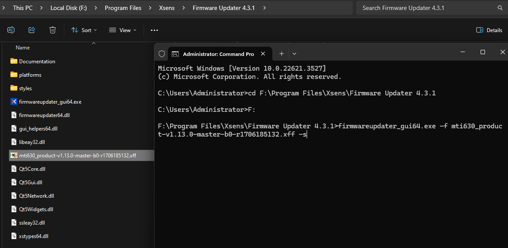
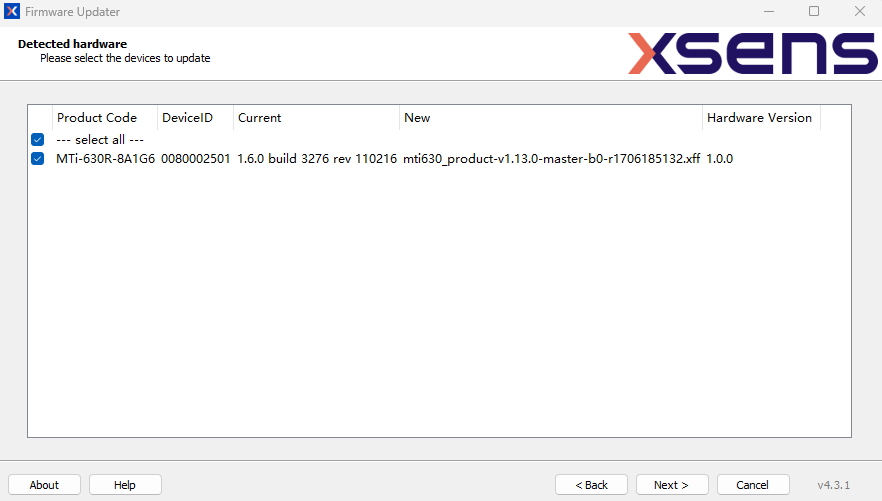
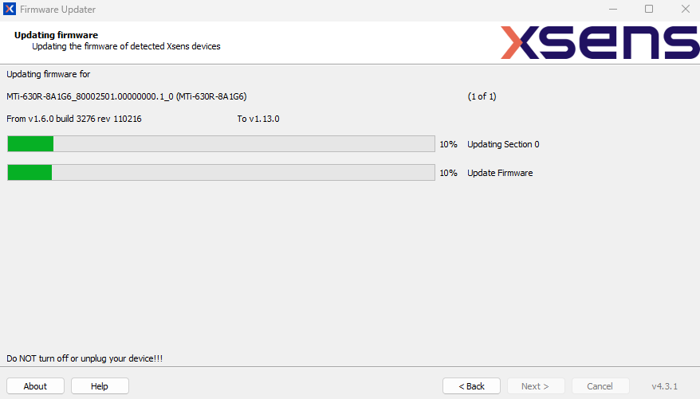
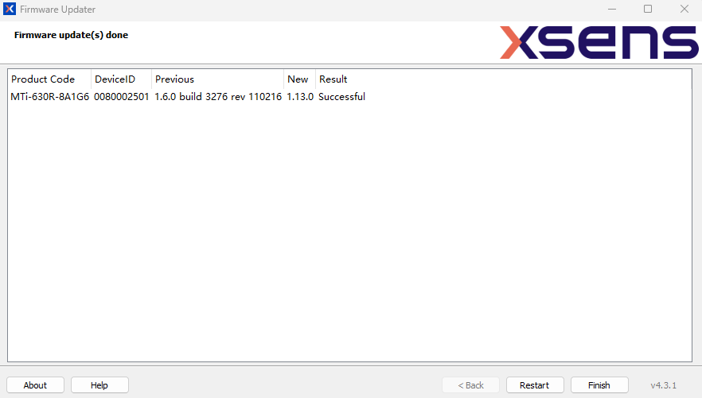

# MTi-630/630R Additional Gyro Bias Setting

## Introduction

This code and firmware file is only valid for MTi-630 or MTi-630R.

The program would firstly measure the sensor's rate of turn(in deg/sec) for certain amount of time, compute the mean values, then prompt user to write the additional offset to the gyro.

The command would add extra offset on top of the factory default calibration values on the MTi, and the result is writing to the Non-volatile memory.

Based on the updated gyro bias calibration values, the orientation performance has good chance to improve. The key to success is that the extra offset that you measured needs to be accurate, in otherwords, no interference from the surrounding environment.

## Update Firmware to v1.13.0

### Download and Install Firmware Updater
Download from [`Xsens Website`](https://www.movella.com/hubfs/FirmwareUpdater.zip)

copy the firmwarefile [mti630_product-v1.13.0-master-b0-r1706185132.xff](./firmware_file/mti630_product-v1.13.0-master-b0-r1706185132.xff) to the installation folder of Firmware Updater Software.

### Update Firmware from Command line
```
firmwareupdater_gui64.exe -f mti630_product-v1.13.0-master-b0-r1706185132.xff -s
```



Then the GUI Firmware Updater would pop up, click Next:




Now that it is successful, click "Finish".


## Install the Xsens Device Api Library with Virtual Environment

```
python -m venv venv
venv\Scripts\activate
pip install xsensdeviceapi-2024.1.0-cp38-none-win_amd64.whl
```
Note that the internet connection is needed, as it would install numpy

## How to Run the Program

Next you could run the program, by default it will run for 100 seconds, but if you want to make it longer, change this line code to a different value at [set_mti_gyro_bias.py](set_mti_gyro_bias.py)
```
seconds_to_measure = 100
```

Please make sure the MTi-630/630R is in a very quiet place, without interference from people walking by, knocking at the table, or machine vibrations, then run:
```
python set_mti_gyro_bias.py
```

After the measurements, the code would compute the gyro mean/std/min/max, and prompt the user to choose 4 options:
 - option 1: Write the measured gyro mean values as the gyro bias
 - option 2: Write your own value to gyro bias
 - option 3: Revert to factory default values
 - option 4: Don't do anything

The prefered choice should be 1, but you could also try other options to see how it would impact your orientation output.


## Note

In this repo, we included the Xsens Device Api Python 3.8 library, if you have different version of Python, you could download the full MT Software Suite 2024.1 at [`Xsens Website`](https://www.movella.com/support/software-documentation), after installation, the Xsens Device Api Python libraries are located at ``C:\Program Files\Xsens\MT Software Suite 2024.1\MT SDK\Python\x64``

The library works for ``x86 platform`` cpus, but not for Arm devices, for Arm devices, you could adapt the code based on the ``C:\Program Files\Xsens\MT Software Suite 2024.1\MT SDK\Examples\xda_public_cpp``


For more details of the command, refer to [this doc](./firmware_file/Additional-Gyro-Bias-Offset_instructions.pdf)


